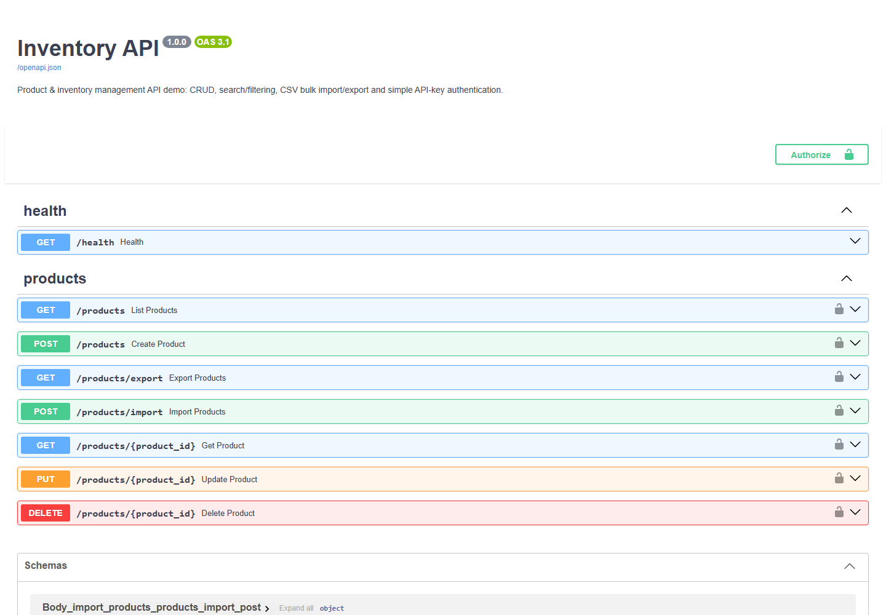

# Inventory REST API

**Portfolio demo — Python (FastAPI) + SQLAlchemy + SQLite**

**Live demo: https://inventory-rest-api-demo.onrender.com/** (redirects to
the interactive Swagger UI — click "Authorize" and use `demo-key-123` to
try every endpoint from the browser; hosted on a free tier, so the first
load can take 30-50 seconds while the server wakes up)



## The problem

A business keeps its product/stock data in a spreadsheet or a system with
no way for other tools to read or update it. Every time a website, a
reporting dashboard or an internal script needs that data, someone exports
a file by hand and emails it around — and it's out of date the moment it's
sent.

## The solution

A small, self-contained REST API backed by a real SQL database:

- **Full CRUD** on products (create, read, update, delete)
- **Search & filtering** — by name/SKU, category, or a `low_stock` flag
  that returns everything at or below its reorder level
- **CSV bulk import/export** — upload a spreadsheet to create/update many
  products at once (existing SKUs are updated, new ones created, bad rows
  are reported individually instead of failing the whole batch, and each
  row is validated with the same rules as the API — no negative prices or
  blank names sneaking in through a CSV); download the current catalog
  as CSV
- **Consistent validation everywhere** — the same rules apply whether data
  comes in through `POST`, `PUT` or CSV import, and `PUT` rejects an
  explicit `null` for a required field instead of letting it reach the
  database as a constraint error
- **Simple API-key authentication** — every endpoint (except `/health`)
  requires an `X-API-Key` header
- **Interactive documentation**, generated automatically at `/docs`
  (Swagger UI) and `/redoc` — no separate docs to maintain
- **Automated tests** (`pytest`) covering auth, CRUD, validation, CSV
  import/export and the low-stock filter

## How it's built

```
app/models.py    SQLAlchemy ORM model (Product)
app/schemas.py   Pydantic request/response schemas + validation
app/crud.py      Database operations (search, create, update, delete)
app/csv_io.py    CSV import/export logic, row-by-row error reporting
app/auth.py      API-key dependency (X-API-Key header)
app/main.py      FastAPI routes wiring it all together
tests/           pytest suite, runs against an isolated in-memory database
```

SQLite for the demo; the same SQLAlchemy models work against
MySQL/Postgres by changing one connection string.

## Run it yourself

```bash
python -m venv .venv
.venv\Scripts\activate        # or: source .venv/bin/activate
pip install -r requirements.txt

uvicorn app.main:app --reload --port 8000
```

The API seeds its own catalog automatically on first startup if the
database is empty (running `seed_data.py` by hand is optional), so it
deploys to a host with an ephemeral disk with no manual setup step.

Open http://127.0.0.1:8000/docs for interactive documentation (click
**Authorize** and enter the demo key below to try every endpoint from the
browser).

Default demo API key: `demo-key-123` (override with the `API_KEY` env var).

## Deploying (e.g. Render free tier)

- Build command: `pip install -r requirements.txt`
- Start command: `uvicorn app.main:app --host 0.0.0.0 --port $PORT`

### Example requests

```bash
# List products (auth required)
curl -H "X-API-Key: demo-key-123" http://127.0.0.1:8000/products

# Create a product
curl -X POST http://127.0.0.1:8000/products \
  -H "X-API-Key: demo-key-123" -H "Content-Type: application/json" \
  -d '{"sku":"TST-001","name":"New Product","category":"Test","unit_price":19.90,"stock_qty":25,"reorder_level":10}'

# Bulk import from CSV
curl -X POST http://127.0.0.1:8000/products/import \
  -H "X-API-Key: demo-key-123" -F "file=@data/products_import_sample.csv;type=text/csv"

# Export the full catalog as CSV
curl -H "X-API-Key: demo-key-123" http://127.0.0.1:8000/products/export -o products.csv
```

## Tests

```bash
pytest
```

8 tests covering: auth required/rejected, full CRUD lifecycle, duplicate
SKU conflict (409), input validation (422), rejecting a null update,
CSV import creating vs. updating vs. rejecting invalid rows, and the
low-stock filter.

## Known limitation

Prices are stored as `float` for simplicity. For a real financial
engagement (invoicing, accounting exports) this would use `Decimal`
end-to-end instead, to avoid floating-point rounding on money — a
deliberate scope cut for a demo, not an oversight.

## Adaptable to your data

This demo models a product/inventory catalog. The same pattern — SQL
database, typed CRUD, search/filtering, CSV in/out, API-key or JWT auth,
auto-generated docs — applies to orders, customers, bookings, or whatever
your business's core data actually is.

## Stack

Python, FastAPI, SQLAlchemy, SQLite, Pydantic, pytest.
